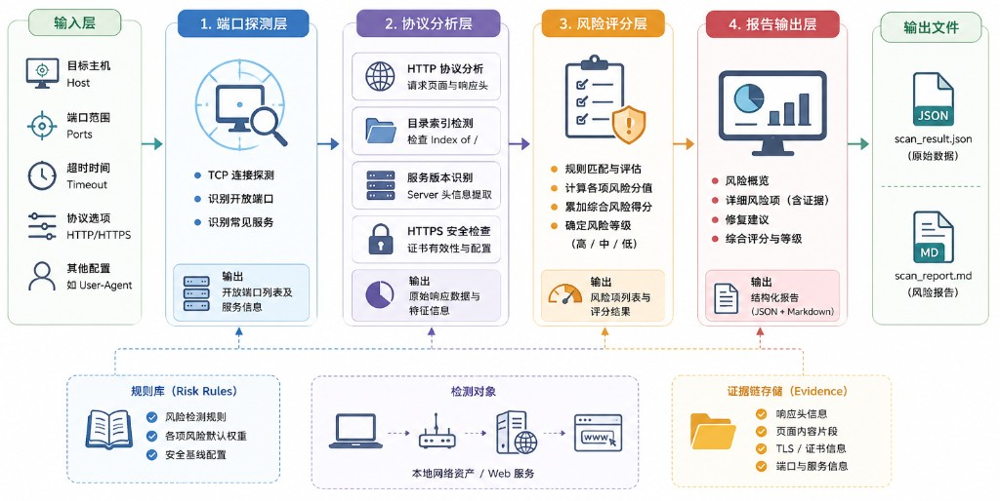
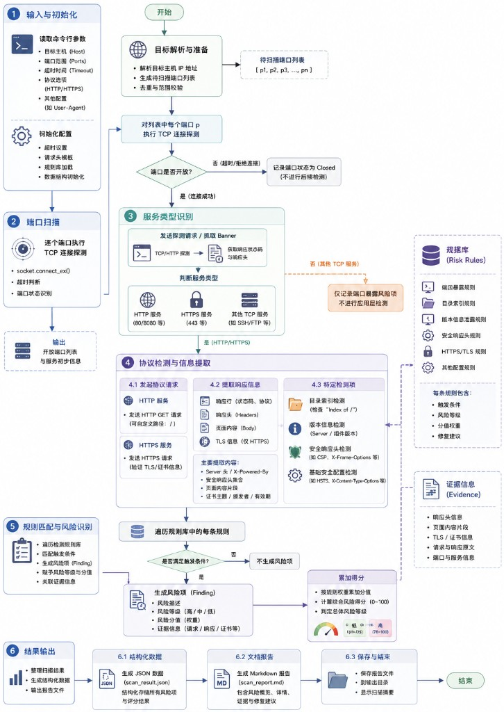
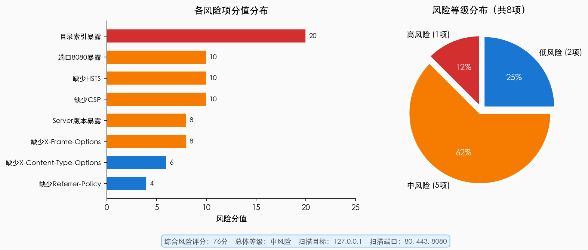
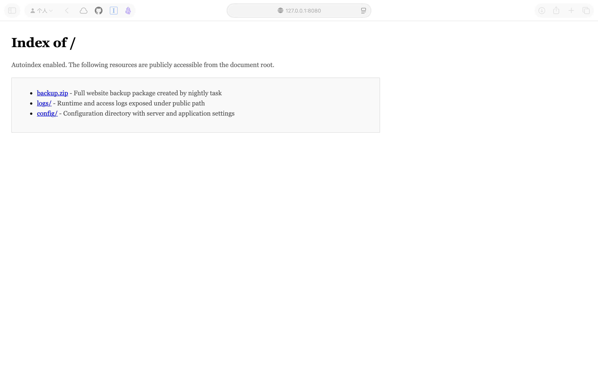

# WebTLS Risk Inspector

**WebTLS Risk Inspector** 是一个面向本地 Web 服务安全配置与 TLS 证书可信性风险的轻量级检测项目。项目使用 Python 标准库实现端口探测、HTTP/HTTPS 协议访问、风险规则判断、综合评分和报告生成，重点体现“风险可见、风险可测、风险可解释”的设计思路。

本项目不依赖第三方安全扫描产品，核心检测逻辑均可直接阅读和复现，适合作为网络信息安全风险技术编程、基础安全巡检原型和 Web 配置风险分析的实验材料。

## 项目图示

### 系统架构



### 检测流程



### 风险结果示例



### 演示站点截图



## 功能特点

- 对指定主机和端口执行 TCP 开放状态检测
- 识别常见 Web 暴露面风险，如测试端口开放、目录索引暴露、Server 版本信息泄露
- 检测常见 HTTP 安全响应头缺失问题，包括 HSTS、CSP、X-Frame-Options、X-Content-Type-Options、Referrer-Policy
- 对 HTTPS 服务进行证书可信性检查，可识别自签名证书或不受信任证书
- 观察 TLS 协议版本和密码套件等基础传输层安全信息
- 基于规则对风险项进行评分，并输出整体风险等级
- 同时生成 JSON 结构化结果和 Markdown 风险报告
- 提供本地弱安全配置 HTTP/HTTPS 演示环境，便于复现实验

## 目录结构

```text
.
├── risk_scanner.py              # 主扫描程序
├── demo_vulnerable_server.py    # 本地弱安全配置 HTTP/HTTPS 演示服务
├── demo_site/                   # 演示站点目录，包含模拟暴露的文件和配置
├── demo_certs/                  # 本地自签名证书目录，证书文件需本地生成
├── results/                     # 四组实验输出结果
│   ├── exp1/
│   ├── exp2/
│   ├── exp3/
│   └── exp4/
├── figures/                     # README 与论文使用的图示材料
├── report.tex                   # 论文 LaTeX 源文件
└── report.pdf                   # 已编译的完整论文报告
```

## 运行环境

- Python 3.10 或更高版本
- 扫描程序仅使用 Python 标准库，无需安装第三方 Python 依赖
- 如需运行 HTTPS 自签名证书实验，需要本机安装 OpenSSL
- 如需重新编译论文 PDF，需要 XeLaTeX 或兼容的 TeX 发行版

## 快速开始

首次运行 HTTPS 演示服务前，需要生成本地自签名证书。证书文件包含私钥，已被 `.gitignore` 排除，不会上传到仓库。

```bash
openssl req -x509 -newkey rsa:2048 -nodes -days 825 \
  -keyout demo_certs/key.pem -out demo_certs/cert.pem \
  -subj "/C=CN/ST=Beijing/L=Beijing/O=NormalTime Lab/CN=127.0.0.1" \
  -addext "subjectAltName=IP:127.0.0.1"
```

启动本地弱安全配置演示服务：

```bash
python3 demo_vulnerable_server.py
```

服务启动后会监听两个端口：

- `http://127.0.0.1:8080`：弱安全配置 HTTP 服务
- `https://127.0.0.1:8443`：使用自签名证书的 HTTPS 服务

在另一个终端执行扫描：

```bash
python3 risk_scanner.py --host 127.0.0.1 --ports 80,443,8080,8443 --output-dir results/exp4
```

查看生成的 Markdown 风险报告：

```bash
cat results/exp4/scan_report.md
```

## 实验复现

每组实验都会输出两类文件：

- `scan_result.json`：完整结构化扫描结果
- `scan_report.md`：适合直接阅读的风险报告

| 实验 | 场景 | 运行条件 | 命令 |
| --- | --- | --- | --- |
| 实验一 | 基础端口与 HTTP 风险检测 | 启动演示服务 | `python3 risk_scanner.py --host 127.0.0.1 --ports 80,443,8080 --output-dir results/exp1` |
| 实验二 | 扩大端口范围扫描 | 启动演示服务 | `python3 risk_scanner.py --host 127.0.0.1 --ports 21,22,23,80,443,3306,6379,8080 --output-dir results/exp2` |
| 实验三 | 无演示服务基线扫描 | 停止演示服务 | `python3 risk_scanner.py --host 127.0.0.1 --ports 80,443,8080 --output-dir results/exp3` |
| 实验四 | HTTPS 自签名证书检测 | 启动演示服务并生成证书 | `python3 risk_scanner.py --host 127.0.0.1 --ports 80,443,8080,8443 --output-dir results/exp4` |

当前已复现结果如下：

| 实验 | 主要风险 | 综合评分 | 风险等级 |
| --- | --- | ---: | --- |
| `exp1` | 8080 测试端口暴露、目录索引暴露、安全响应头缺失、Server 版本信息泄露 | 76 | 中风险 |
| `exp2` | 扩大端口范围后额外识别到开放 SSH 端口 | 81 | 高风险 |
| `exp3` | 无目标演示服务，未发现风险项 | 0 | 低风险 |
| `exp4` | 在实验一基础上新增 HTTPS 自签名证书风险 | 88 | 高风险 |

其中 `exp2` 的 22 端口结果取决于复现机器是否开启本地 SSH 服务；若 22 端口关闭，综合评分会相应降低，但不影响端口范围扩大场景的验证逻辑。

## 报告说明

论文报告位于：

- `report.pdf`：已编译的完整 PDF 报告
- `report.tex`：LaTeX 源文件

报告内容包括研究背景、系统设计、核心代码实现、四组实验结果、风险展示、主流工具对比、预防措施、参考文献和附录。附录中补充了实验复现命令、结果文件对应关系、核心代码模块说明和评分规则说明。

## 安全声明

本项目仅用于本地可控环境下的安全实验和风险检测原型研究。`demo_site/` 中的配置、日志、密码和备份文件均为模拟数据，用于演示风险识别效果。请勿在未获得授权的情况下扫描他人主机、服务或网络资产。
